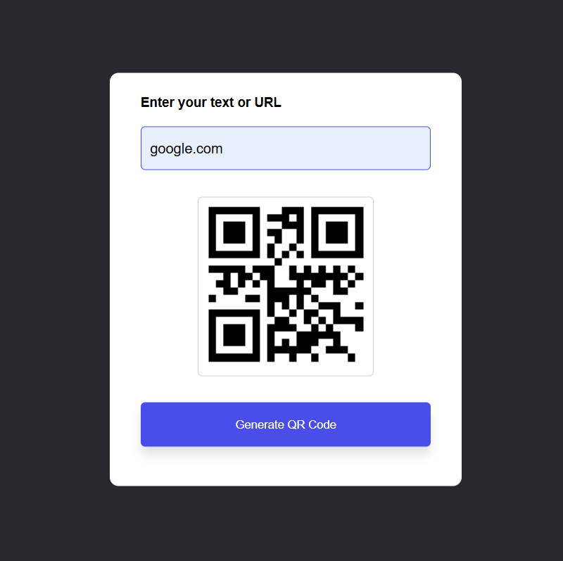

# 🔳 QR Code Generator

A sleek and responsive web application that generates QR codes instantly using the GoQR API. Built with pure HTML, CSS, and JavaScript.

## ✨ Features

- 🔳 **Instant QR Generation**: Create QR codes in real-time
- 🌐 **API Powered**: Uses GoQR.me API for reliable QR generation
- 📱 **Fully Responsive**: Works perfectly on all devices
- 🎨 **Clean Interface**: Modern, user-friendly design
- ⚡ **Fast & Lightweight**: No dependencies, pure vanilla JavaScript
- 📥 **Easy Download**: Download QR codes as PNG images

## 🛠️ Built With

- **HTML5** - Semantic structure
- **CSS3** - Modern styling with Flexbox
- **JavaScript** - API integration and functionality
- **GoQR API** - QR code generation service

## 🚀 Live Demo

👉 [Try the QR Code Generator](https://ghazi829.github.io/QR-Code-Generator/)

## 📸 Preview



## 🎯 How to Use

1. **Enter Text or URL** - Type any text, URL, or data in the input field
2. **Generate QR Code** - Click the generate button
3. **Download** - Save your QR code as a PNG image
4. **Share** - Use the QR code for websites, contact info, WiFi credentials, etc.

## 📁 Project Structure

```
qr-code-generator/
├── index.html          # Main application file And QR generation logic & API integration
├── style.css           # Modern responsive styling
├── Preview.png          
└── README.md           # Project documentation
```

## 🌐 API Reference

This project uses the [GoQR API](https://goqr.me/api/) for QR code generation:

```javascript
// API Endpoint
const apiUrl = `https://api.qrserver.com/v1/create-qr-code/?data=${data}&size=200x200`;
```

## 🔧 Installation

1. **Clone the repository**
   ```bash
   git clone https://github.com/ghazi829/QR-Code-Generator.git
   ```

2. **Navigate to the directory**
   ```bash
   cd QR-Code-Generator
   ```

3. **Open in browser**
   - Simply open `index.html` in your web browser
   - No build process or dependencies required!

## 💡 Use Cases

- **Website URLs** - Share your website quickly
- **Contact Information** - VCard details for business cards
- **WiFi Access** - Share WiFi credentials easily
- **Social Media** - Direct links to profiles
- **Product Information** - Links to product pages
- **Event Details** - Share event information

## 🖥️ Browser Support

- ✅ Chrome (latest)
- ✅ Firefox (latest)
- ✅ Safari (latest)
- ✅ Edge (latest)
- ✅ Mobile browsers

## 🤝 Contributing

Contributions are welcome! Feel free to:
1. Fork the project
2. Create a feature branch
3. Commit your changes
4. Push to the branch
5. Open a Pull Request

## 📜 License

This project is open source and available under the [MIT License](LICENSE).

---

**Developed with ❤️ by Pir Ghazi**

*Making QR code generation simple and accessible for everyone* 🚀✨